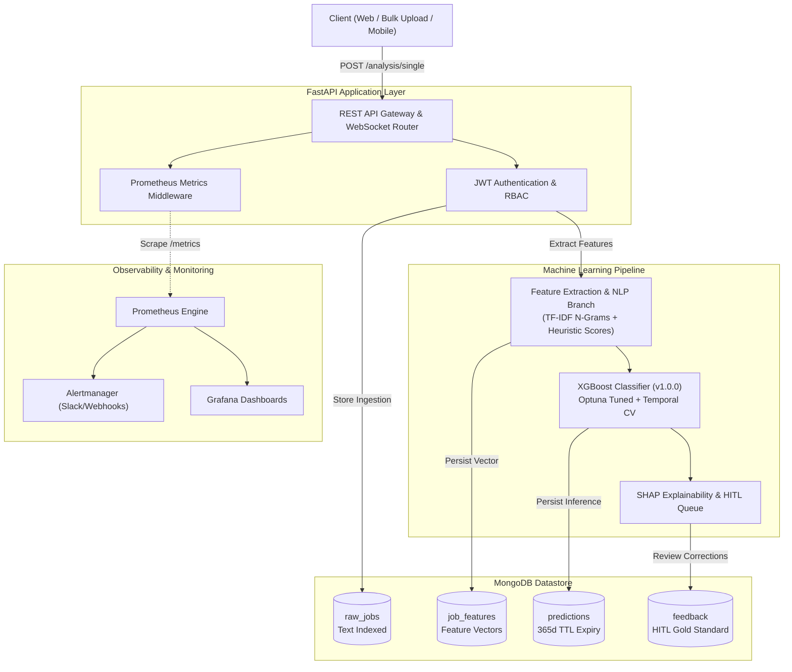

# AI-Based Fake Job Advertisement Detection System

[](https://github.com/asantemaicenne/fake-job-detection-system/actions/workflows/ci.yml)
[](https://www.python.org/)
[](https://fastapi.tiangolo.com/)
[](https://www.mongodb.com/)
[](https://xgboost.readthedocs.io/)
[](https://opensource.org/licenses/MIT)

An enterprise-grade, end-to-end Machine Learning and NLP system designed to detect fraudulent job advertisements, combat recruitment scams, and protect candidates. Built with Python 3.10+, scikit-learn, XGBoost, Optuna, FastAPI, and MongoDB.

---

## System Architecture



---

## Core Capabilities

1. **Multi-Branch NLP Preprocessing:** Merges TF-IDF n-grams with tabular heuristics using scikit-learn `ColumnTransformer`.
2. **Explicit &amp; Structural Heuristics:** Flags wire transfers, cryptocurrency deposits, sensitive PII requests, generic recruiter domains (`@gmail.com`), and missing company domains.
3. **Temporal Cross-Validation:** Uses `TimeSeriesSplit` during Optuna training to eliminate temporal data leakage.
4. **Explainability &amp; Ethical Safeguards:** Provides individual prediction feature attributions via SHAP and routes ambiguous classifications ($0.40 \le p \le 0.65$) to a Human-in-the-Loop review queue.
5. **GDPR Right-to-Erasure Utility:** Automated cascade hard-deletion across all database collections.
6. **Observability:** Prometheus metrics (`/metrics`), Alertmanager rules, and Grafana telemetry.

---

## Quickstart

### Prerequisites
* Docker &amp; Docker Compose
* Python 3.10+
* Git

### Local Environment Setup

```powershell
# 1. Clone repository
git clone https://github.com/<your-username>/fake-job-detection-system.git
cd fake-job-detection-system

# 2. Configure virtual environment
python -m venv venv
.\venv\Scripts\Activate.ps1
pip install -r requirements.txt

# 3. Spin up infrastructure services
docker-compose up -d mongodb prometheus alertmanager grafana

# 4. Train baseline model artifact
python scripts/train_model.py --trials 15 --splits 3

# 5. Launch FastAPI server
uvicorn src.api.main:app --reload --port 8000
```

## API Reference

| Method | Endpoint | Access Role | Description |
| --- | --- | --- | --- |
| GET | `/health` | Public | Service health and model version check |
| GET | `/metrics` | Public / Scraper | Prometheus metrics export |
| POST | `/api/v1/auth/dev-token` | Public | Generate development JWT bearer tokens |
| POST | `/api/v1/analysis/single` | `admin`, `analyst`, `api_user` | Real-time single job fraud analysis |
| POST | `/api/v1/analysis/bulk` | `admin`, `analyst` | Batch job submission (up to 100 items) |
| POST | `/api/v1/analysis/feedback` | `admin`, `analyst` | Submit HITL ground-truth audit reviews |
| GET | `/api/v1/analysis/results` | `admin`, `analyst` | Paginated prediction query with filters |
| WS | `/api/v1/analysis/ws/status` | Public | Real-time status update channel |

Interactive OpenAPI documentation is accessible at `http://127.0.0.1:8000/api/v1/docs`.

## Data Schema Overview

| Collection | Key Indexed Fields | Storage Type | Retention / Lifecycle |
| --- | --- | --- | --- |
| `raw_jobs` | `description` (text), `source_platform`, `posted_at` | Active Store | 180 days active |
| `job_features` | `job_id` (unique) | Feature Store | Linked to Raw Job |
| `predictions` | `job_id` (unique), `timestamp` | Cold Store | 365-day TTL index |
| `feedback` | `job_id` (unique), `reviewed_at` | Audit Store | Permanent (Gold Standard) |

## Testing

Execute integration and unit tests:

```powershell
pytest tests/ -v
```

## License

Distributed under the MIT License. See `LICENSE` for details.
